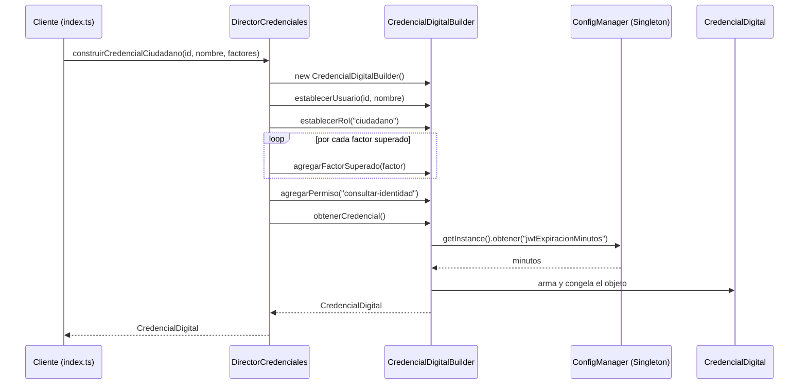
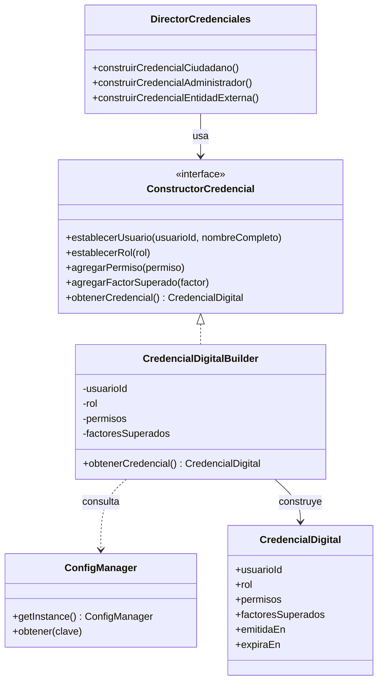
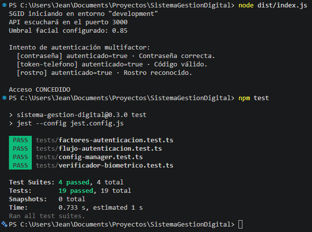
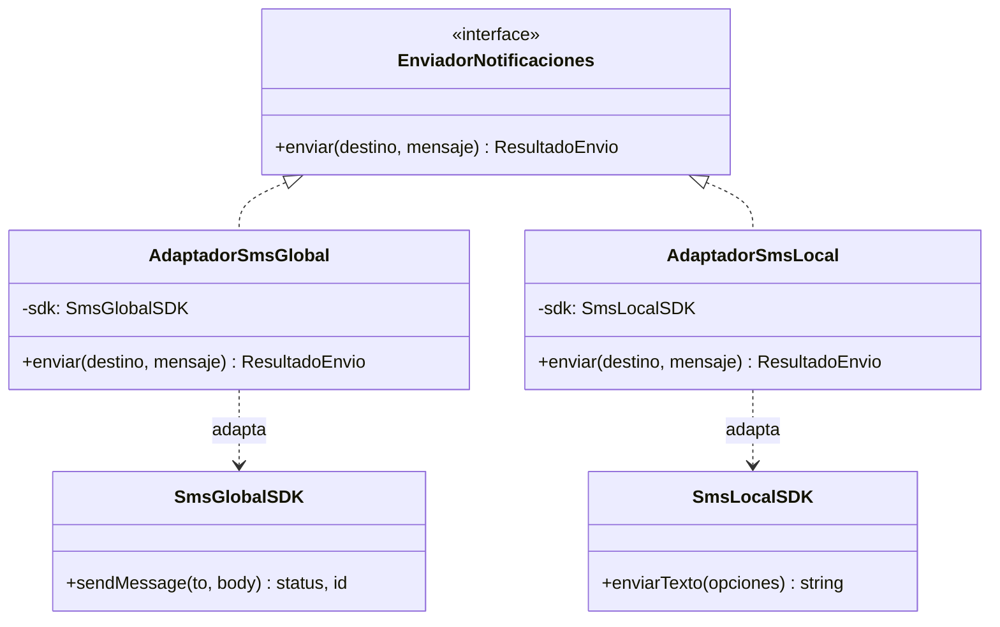
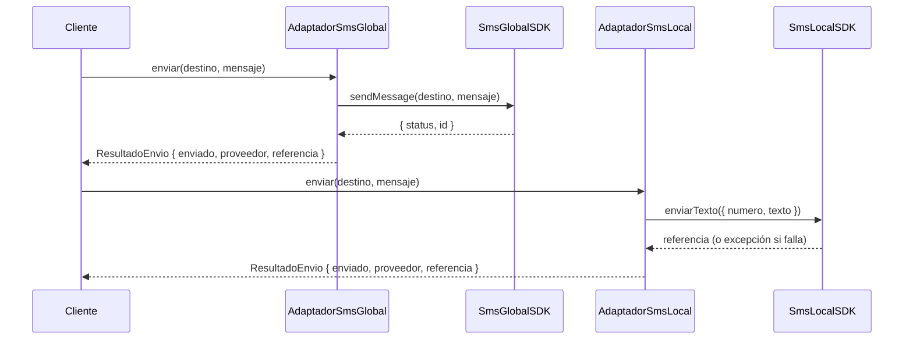
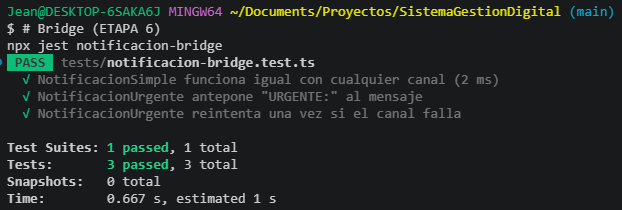
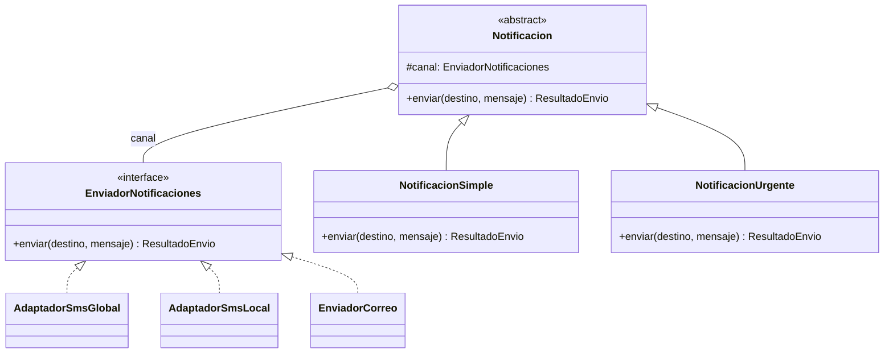
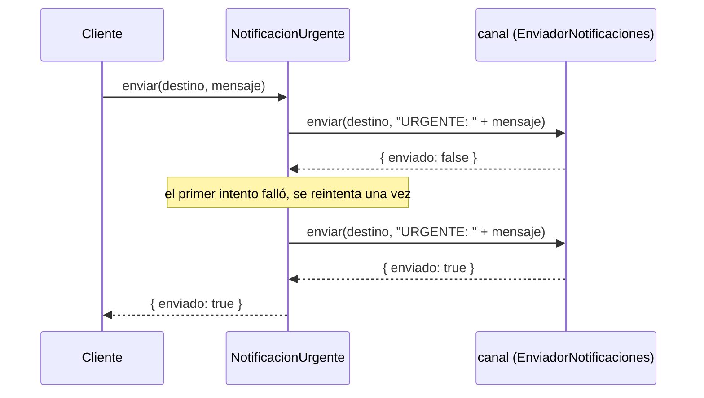

# Sistema de Gestión de Identidad Digital (SGID) - *ETAPA #0*

## Descripción general

Este proyecto corresponde al desarrollo de un sistema backend enfocado en el sector gobierno, cuyo propósito central es unificar la manera en que los ciudadanos acreditan su identidad frente a distintas entidades del Estado. En lugar de que cada dependencia gubernamental maneje su propio esquema de autenticación, el sistema plantea un componente único capaz de validar identidad mediante biometría multifactor, administrar roles y permisos, y exponer esa información de forma controlada a otros servicios públicos que la requieran.

## Justificación

La motivación de este trabajo surge de un problema bastante recurrente en la administración pública: los sistemas de identidad suelen estar dispersos entre distintas plataformas, cada una con su propio mecanismo de acceso, generalmente basado en credenciales simples (usuario y contraseña). Esto trae consigo varias dificultades:

- Mayor exposición a suplantación de identidad, dado lo débil de los mecanismos actuales.
- Necesidad de que el ciudadano gestione múltiples credenciales para trámites distintos.
- Poca capacidad de auditoría sobre quién accedió a qué información y en qué momento.
- Baja interoperabilidad entre las entidades del Estado, que terminan trabajando de forma aislada.

Frente a este panorama, se propone construir un sistema que centralice la verificación de identidad y que pueda ser consumido por otros sistemas gubernamentales mediante integraciones definidas, reduciendo así la duplicidad de esfuerzos y elevando el nivel de seguridad general.

## Objetivos del proyecto

- Implementar un mecanismo de autenticación biométrico que incorpore un segundo factor de verificación.
- Definir un esquema de roles y permisos que permita diferenciar el nivel de acceso según el tipo de usuario o entidad.
- Habilitar puntos de integración para que servicios gubernamentales externos puedan validar identidades a través del sistema.
- Ajustar el manejo de la información sensible a criterios de seguridad exigidos a nivel estatal.

## Funcionalidades contempladas

**Autenticación biométrica multifactor.** El acceso no depende únicamente de una contraseña, sino que se combina con verificación biométrica para reducir el riesgo de accesos no autorizados.

**Gestión de permisos y roles.** Se maneja un modelo de control de acceso basado en roles (RBAC), donde ciudadanos, administradores y entidades externas cuentan con distintos niveles de visibilidad y acción dentro del sistema.

**Integración con servicios gubernamentales.** El sistema expone una API pensada para que otras plataformas del Estado puedan consultar y validar identidades sin necesidad de reimplementar su propio mecanismo de autenticación.

**Cumplimiento de estándares de seguridad.** Se contempla cifrado de la información, registro de auditoría y trazabilidad de las operaciones que involucren datos sensibles del ciudadano.

## Actores involucrados

| Actor | Rol dentro del sistema |
|---|---|
| Ciudadano | Persona que se autentica y cuya identidad es gestionada por el sistema |
| Administrador | Encargado de configurar roles, permisos y supervisar el funcionamiento general |
| Entidad gubernamental externa | Sistema que consume la identidad verificada a través de la API |

## Enfoque arquitectónico

Para este proyecto se optó por el patrón **Hexagonal (Ports & Adapters)**. La razón detrás de esta elección tiene que ver con la naturaleza del sistema: al depender de múltiples integraciones externas (dispositivos biométricos, servicios de otras entidades, base de datos), resultaba conveniente aislar la lógica de negocio de los detalles técnicos de cada integración. De esta forma, el núcleo del sistema no depende directamente de ninguna tecnología específica, y los adaptadores pueden modificarse o reemplazarse sin alterar las reglas de negocio.

```
src/
├── domain/          # Entidades y reglas de negocio del sistema
├── application/     # Casos de uso y definición de puertos (interfaces)
├── infrastructure/  # Adaptadores concretos: base de datos, APIs externas, biometría
└── interfaces/      # Capa de entrada, controladores REST
```

## Tecnologías utilizadas

- Lenguaje: TypeScript
- Entorno de ejecución: Node.js
- Base de datos: PostgreSQL
- ORM: TypeORM
- Autenticación: JWT combinado con OAuth2 y un adaptador biométrico
- Pruebas: Jest

## Consideraciones no funcionales

Más allá de las funcionalidades propias del sistema, se tuvieron en cuenta ciertos aspectos que resultan igual de relevantes dado el contexto gubernamental del proyecto: la seguridad de la información (cifrado y auditoría), la disponibilidad del servicio, la capacidad de escalar conforme aumente el número de ciudadanos e integraciones, y la trazabilidad de cada operación realizada sobre la identidad de un usuario.

---

# ETAPA 2 — Patrón Singleton (primera funcionalidad)

En esta etapa se armó la primera parte con código del sistema y se le aplicó
el patrón **Singleton**.

## Qué se hizo

Se construyó un **Gestor de Configuración** (`ConfigManager`): la pieza que
guarda los datos que el sistema necesita para arrancar (puerto de la API,
clave de los tokens, datos de la base de datos, qué tan exigente es la
verificación biométrica). Los lee **una sola vez** al inicio y después se los
pasa igual a cualquier parte del sistema que se los pida.

## Por qué Singleton

Porque la configuración tiene que ser **una sola para todos**. Si cada módulo
armara la suya, podrían terminar trabajando con datos distintos. El Singleton
asegura que exista una única copia, que se crea la primera vez que hace falta
y a la que siempre se llega por el mismo lado (`ConfigManager.getInstance()`).

## Cómo incide en el código

- Todos los módulos leen la configuración del mismo lugar, así que no hay
  descuadres entre unos y otros.
- Los datos se leen y se revisan una sola vez, no cada rato.
- No hay que andar pasando la configuración de un lado a otro por parámetros.
- Si algún día cambia de dónde salen esos datos, se ajusta solo dentro del
  gestor y nada más.

Ejemplo dentro del proyecto: el `VerificadorBiometrico` no tiene el umbral
escrito a mano en el código, se lo pide al gestor.

## Documentación detallada

Explicación completa y con calma (qué es el patrón, cómo afecta al código,
ventajas y cosas a tener en cuenta): [`docs/ETAPA-2-Singleton.md`](docs/ETAPA-2-Singleton.md)

## Cómo ejecutar

```bash
npm install       # instalar dependencias
npm test          # correr las pruebas
npm run build     # compilar
node dist/index.js  # ver la demostración
```

## Pruebas / Testing

Las pruebas están en [`tests/`](tests) y se ejecutan con `npm test`.
Cubren el comportamiento del patrón (instancia única, carga única,
inmutabilidad, validaciones) y su uso desde otro módulo.

Estado actual: **12 pruebas, todas en verde.**

## Archivos añadidos en esta etapa

```
src/infrastructure/config/config-manager.ts     # El Singleton
src/application/auth/verificador-biometrico.ts   # Módulo que lo consume
src/index.ts                                     # Demostración
tests/config-manager.test.ts                     # Pruebas del patrón
tests/verificador-biometrico.test.ts             # Pruebas del uso
```

---

# ETAPA 3 — Patrón Factory Method (autenticación multifactor)

En esta etapa se sumó la **autenticación multifactor** y se le aplicó el
patrón **Factory Method**.

## En una frase

El sistema comprueba la identidad combinando tres factores:

| Factor | Tipo | Cómo se comprueba |
|---|---|---|
| Contraseña | *algo que sabes* | Coincide con la contraseña registrada del usuario |
| Token al teléfono | *algo que tienes* | Coincide con el código enviado por SMS y todavía vigente (5 min) |
| Rostro | *algo que eres* | El puntaje del sensor facial alcanza el umbral configurado |

El **procedimiento** para validar un factor es siempre el mismo; lo único que
cambia es *qué factor* se usa. Esa elección es la que resuelve el Factory
Method.

## ¿Qué es el patrón Factory Method? (contado fácil)

Piensa en una oficina de trámites con varias ventanillas. El **procedimiento**
es idéntico en todas: pides turno, entregas tus datos, te dan un resultado. Lo
que cambia es la **herramienta** de cada ventanilla: una revisa contraseñas,
otra códigos de SMS, otra tiene la cámara.

El Factory Method es esa idea en código:

1. Una clase "madre" (**el Creador**) define el procedimiento completo.
2. En medio de ese procedimiento hay **un hueco**: "aquí va el factor", pero
   la clase madre no dice cuál.
3. Cada **subclase** rellena ese hueco devolviendo el factor que le toca.

La clase madre nunca escribe `new FactorContrasena()`. Solo llama a su método
`crearFactor()` y confía en que la subclase lo resuelva.

## Los papeles del patrón en el proyecto

| Papel en el patrón | En el código |
|---|---|
| Creador (abstracto) | `FlujoAutenticacion` |
| Método fábrica | `crearFactor()` |
| Creadores concretos | `FlujoContrasena`, `FlujoTokenTelefono`, `FlujoRostro` |
| Producto (interfaz) | `FactorAutenticacion` |
| Productos concretos | `FactorContrasena`, `FactorTokenTelefono`, `FactorRostro` |

El **procedimiento común** vive en `FlujoAutenticacion.autenticar()`: limpia la
entrada, corta si viene vacía, ejecuta el factor y devuelve un resultado con
la misma forma para todos (`factor`, `autenticado`, `motivo`).

Cada **factor** guarda su propia regla:

- `FactorContrasena` compara contra la contraseña registrada.
- `FactorTokenTelefono` compara el código **y** revisa que no haya expirado.
- `FactorRostro` compara el puntaje facial contra el umbral, que **no está
  escrito ahí**: lo pide al Gestor de Configuración (el Singleton de la
  ETAPA 2).

## ¿Cómo incide (afecta) este patrón en el código?

### Sin Factory Method

El flujo tendría un `switch` que hay que reabrir con cada factor nuevo:

```ts
if (tipo === 'contraseña') { /* crea y usa contraseña */ }
else if (tipo === 'token') { /* crea y usa token */ }
else if (tipo === 'rostro') { /* crea y usa rostro */ }
```

La lógica de "cómo se autentica" queda mezclada con la de "qué factor es", y
cada cambio arriesga romper lo que ya funcionaba.

### Con Factory Method

- **El procedimiento se escribe una sola vez**, en `FlujoAutenticacion`.
- **Agregar un factor es agregar una clase** (por ejemplo, una llave física
  USB): no se toca lo existente (principio abierto/cerrado).
- **Cada factor guarda su regla en su propio archivo**, sin estorbar a los
  demás.
- **El resto del sistema trata a todos los flujos igual**: recibe un
  `FlujoAutenticacion` y llama a `autenticar()`, sin saber cuál es. Eso es lo
  que permite el intento multifactor: recorrer una lista de flujos distintos
  con el mismo código.

### Conexión con la ETAPA 2

`FactorRostro` no tiene el umbral escrito a mano:

```ts
const umbral = ConfigManager.getInstance().obtener('biometriaUmbralMinimo');
const superado = puntaje >= umbral;
```

El **Singleton** garantiza que ese umbral sea único para todo el sistema y el
**Factory Method** lo aplica dentro del factor facial sin que el flujo se
entere.

## Dónde encaja en la arquitectura hexagonal

Productos y creadores viven en la capa de **aplicación** (`application/auth`):
orquestan el caso de uso "autenticar a una persona" y, en el caso del rostro,
consultan la configuración. La capa de infraestructura solo aporta ese dato.

## Cosas a tener en cuenta del Factory Method

| Punto flojo | Qué se hizo aquí |
|---|---|
| Aparecen varias clases pequeñas (una por producto y otra por creador) | Se aceptó a cambio de que cada archivo sea corto y de una sola responsabilidad |
| Puede ser exagerado si solo hubiera un factor | Aquí hay tres reales y se esperan más, así que se justifica |
| El creador podría cargarse de lógica | `FlujoAutenticacion` solo limpia la entrada y arma el resultado; la regla de cada factor está en su propia clase |

## Pruebas / Testing

Las pruebas nuevas están en [`tests/`](tests):

**`tests/factores-autenticacion.test.ts`** — cada factor (Producto) por separado:

| Prueba | Qué revisa |
|---|---|
| Contraseña | Se acepta solo si coincide con la registrada |
| Token al teléfono | Vale solo si es el código enviado y no expiró |
| Rostro | Se mide contra el umbral que entrega el Singleton |

**`tests/flujo-autenticacion.test.ts`** — el Factory Method:

| Prueba | Qué revisa |
|---|---|
| Creación del factor | `crearFactor()` devuelve el producto correcto en cada subclase |
| Paso común | El creador rechaza una entrada vacía sin ejecutar el factor |
| Factory Method + Singleton | Si cambia el umbral en config, el flujo de rostro cambia su decisión |
| Uso polimórfico | Un mismo código recorre los tres flujos en un intento multifactor |

Estado actual: **19 pruebas, todas en verde** (12 de la ETAPA 2 + 7 nuevas).


## Archivos añadidos en esta etapa

```
src/application/auth/factor-autenticacion.ts     # Contrato (Producto) + ResultadoFactor
src/application/auth/factor-contrasena.ts         # Producto concreto
src/application/auth/factor-token-telefono.ts     # Producto concreto
src/application/auth/factor-rostro.ts             # Producto concreto (usa el Singleton)
src/application/auth/flujo-autenticacion.ts        # Creador abstracto (define el Factory Method)
src/application/auth/flujo-contrasena.ts           # Creador concreto
src/application/auth/flujo-token-telefono.ts       # Creador concreto
src/application/auth/flujo-rostro.ts               # Creador concreto
tests/factores-autenticacion.test.ts              # Pruebas de los Productos
tests/flujo-autenticacion.test.ts                 # Pruebas del Factory Method
```

---

# ETAPA 4 — Patrón Builder (emisión de la credencial digital)

En esta etapa se sumó la **emisión de la credencial digital** que recibe un
usuario tras autenticarse, y se le aplicó el patrón **Builder**.

## En una frase

Una `CredencialDigital` (usuario, rol, permisos, factores con los que se
autenticó, fecha de emisión y de expiración) es un objeto con varias partes
opcionales que se arman de a poco. En vez de un constructor con muchos
parámetros, un **builder** la arma paso a paso y un **director** conoce la
receta de permisos según el rol (ciudadano, administrador, entidad externa).

## ¿Qué es el patrón Builder?

Piensa en pedir una hamburguesa personalizada: primero el pan, luego la
carne, después decides qué agregarle (queso, tocineta, salsas), y al final
"arman" el pedido. Nadie llama a un constructor gigante con veinte
parámetros donde hay que acordarse del orden de cada ingrediente.

El Builder es esa idea en código:

1. Un objeto **builder** ofrece métodos para ir agregando partes
   (`establecerUsuario()`, `agregarPermiso()`, etc.), uno por uno.
2. Al final se llama a un método (`obtenerCredencial()`) que entrega el
   objeto ya armado y revisado.
3. Un **director**, si existe, conoce recetas fijas (por ejemplo, "así se arma
   la credencial de un administrador") y usa el builder para seguirlas, sin
   que quien lo llama tenga que saber el detalle de cada paso.

## Los papeles del patrón en el proyecto

| Papel en el patrón | En el código |
|---|---|
| Producto | `CredencialDigital` |
| Builder (interfaz) | `ConstructorCredencial` |
| Builder concreto | `CredencialDigitalBuilder` |
| Director | `DirectorCredenciales` |

`CredencialDigitalBuilder` va guardando usuario, rol, permisos y factores
superados, y solo en `obtenerCredencial()`:

- valida que no falte nada esencial (usuario, rol, al menos un factor),
- calcula la fecha de expiración con los minutos de vigencia del **Gestor de
  Configuración** (el Singleton de la ETAPA 2),
- entrega la credencial ya congelada (`Object.freeze`).

`DirectorCredenciales` tiene una receta por cada actor del sistema (ver
`Actores involucrados` más arriba): `construirCredencialCiudadano()`,
`construirCredencialAdministrador()` y `construirCredencialEntidadExterna()`.
Cada una arma el mismo tipo de objeto pero con permisos distintos.

## ¿Cómo incide (afecta) este patrón en el código?

### Sin Builder

La credencial se armaría con un constructor o una función con muchos
parámetros, varios de ellos opcionales:

```ts
crearCredencial('u1', 'Ana', 'ciudadano', ['contraseña', 'rostro'], ['consultar-identidad'], ...)
```

Fácil de llamar mal (orden de argumentos, olvidar uno) y difícil de leer.

### Con Builder

- **Se arma de a poco y con nombre en cada paso**
  (`.establecerRol('ciudadano').agregarPermiso(...)`), sin adivinar el orden
  de parámetros.
- **La validación queda en un solo lugar** (`obtenerCredencial()`): no se
  puede olvidar revisar un dato antes de emitir la credencial.
- **El director evita repetir la receta de cada rol** en cada lugar del
  código que necesite emitir una credencial.
- **Agregar un permiso o un rol nuevo no toca al builder**, solo al director
  (o a quien llame al builder directamente).

### Cómo se conecta con las etapas anteriores

La credencial se emite **después** de un intento de autenticación
multifactor (ETAPA 3) exitoso, y con los factores que sí se superaron:

```ts
const credencial = director.construirCredencialCiudadano(id, nombre, factoresSuperados);
```

Y su vigencia no está escrita a mano: sale del mismo Singleton que ya
entregaba el umbral biométrico.

```ts
const minutos = ConfigManager.getInstance().obtener('jwtExpiracionMinutos');
```

## Dónde encaja en la arquitectura hexagonal

- `CredencialDigital` (el producto) vive en el **dominio**: es solo la forma
  del dato, sin dependencias externas.
- El builder y el director viven en la **aplicación**: orquestan el caso de
  uso "emitir una credencial" y consultan la configuración.

## Cosas a tener en cuenta del Builder

| Punto flojo | Qué se hizo aquí |
|---|---|
| Puede ser exagerado si el objeto tuviera pocos campos | Aquí hay validaciones y un cálculo (la expiración), no es solo "juntar campos" |
| El director puede volverse un cajón de recetas si crecen mucho | Por ahora son tres, una por actor del sistema; si crecen se pueden separar por archivo |
| El builder se puede reutilizar por accidente entre credenciales | El director crea un builder nuevo en cada método, así que no se mezclan datos |

## Pruebas / Testing

Las pruebas nuevas están en [`tests/`](tests):

**`tests/credencial-digital-builder.test.ts`** — el Builder:

| Prueba | Qué revisa |
|---|---|
| Armado paso a paso | Los permisos y factores quedan como se fueron agregando |
| Validación | No entrega la credencial si falta usuario, rol o factores |
| Vigencia | La expiración usa los minutos del Singleton de configuración |

**`tests/director-credenciales.test.ts`** — el Director:


| Prueba | Qué revisa |
|---|---|
| Recetas por rol | Cada método arma el rol y los permisos que le corresponden |
| Independencia | Dos credenciales seguidas no comparten datos entre sí |

Estado actual: **24 pruebas, todas en verde** (19 de las etapas anteriores + 5 nuevas).

## UML del flujo (Builder)





## Archivos añadidos en esta etapa

```
src/domain/credencial/credencial-digital.ts            # Producto
src/application/credencial/constructor-credencial.ts    # Builder (interfaz)
src/application/credencial/credencial-digital-builder.ts # Builder concreto
src/application/credencial/director-credenciales.ts      # Director
tests/credencial-digital-builder.test.ts                # Pruebas del Builder
tests/director-credenciales.test.ts                     # Pruebas del Director
```

---

# ETAPA 5 — Patrón Adapter (envío de SMS)

En esta etapa se sumó el **envío del código de seguridad por SMS** (el que
usa el factor `token-telefono` de la ETAPA 3) y se le aplicó el patrón
**Adapter**.

## En una frase

El sistema puede tener que enviar SMS a través de distintos proveedores
externos, y cada proveedor trae su propio SDK con su propia forma de
funcionar. El Adapter envuelve cada SDK para que, de cara al resto del
sistema, todos se usen exactamente igual.

## ¿Qué es el patrón Adapter? (contado fácil)

Piensa en un cargador de celular y un enchufe de otro país: el cargador no
cambia, pero necesitas un adaptador en el medio para que la clavija encaje.
El adaptador no hace el trabajo pesado (eso lo sigue haciendo el cargador),
solo traduce una forma de conexión a otra.

En código pasa lo mismo con dos SDKs de SMS distintos:

- Uno espera `sendMessage(to, body)` y devuelve `{ status, id }`.
- El otro espera `enviarTexto({ numero, texto })`, devuelve solo un texto y
  **lanza una excepción** si algo sale mal.

Ninguno de los dos habla el mismo "idioma" que el resto del sistema necesita.
El Adapter traduce cada uno a una interfaz común, para que quien envía el SMS
no tenga que saber con cuál proveedor está hablando.

## Los papeles del patrón en el proyecto

| Papel en el patrón | En el código |
|---|---|
| Interfaz que el sistema espera (Target) | `EnviadorNotificaciones` |
| Clases externas con forma distinta (Adaptee) | `SmsGlobalSDK`, `SmsLocalSDK` |
| Adaptadores | `AdaptadorSmsGlobal`, `AdaptadorSmsLocal` |

Cada adaptador recibe el SDK del proveedor, lo llama con su forma propia y
devuelve siempre lo mismo: `{ enviado, proveedor, referencia }`. Uno traduce
un `status: 'SENT' | 'FAILED'`; el otro atrapa la excepción y la convierte en
`enviado: false`, sin que quien llama note la diferencia.

## ¿Cómo incide (afecta) este patrón en el código?

### Sin Adapter

Quien necesite enviar un SMS tendría que conocer el SDK específico de cada
proveedor, revisar su forma particular de éxito/error, y repetir esa lógica
en cada lugar del sistema que envíe mensajes. Cambiar de proveedor obligaría
a tocar todo ese código disperso.

### Con Adapter

- **El resto del sistema solo conoce `EnviadorNotificaciones`**, nunca los
  SDKs reales.
- **Cambiar o agregar un proveedor es agregar un adaptador nuevo**, sin tocar
  el código que ya envía notificaciones.
- **Las diferencias raras de cada SDK** (una excepción en vez de un valor de
  retorno, por ejemplo) quedan encerradas dentro de su propio adaptador.

### Conexión con las etapas anteriores

El código que se envía por SMS es el mismo que después verifica
`FactorTokenTelefono` (ETAPA 3):

```ts
const envio = new AdaptadorSmsGlobal().enviar(telefono, `Tu código es ${codigo}`);
// ...
new FlujoTokenTelefono(codigo, Date.now()).autenticar(codigoIngresado);
```

## Dónde encaja en la arquitectura hexagonal

Aquí el patrón Adapter y el "adaptador" de la arquitectura hexagonal son,
literalmente, la misma idea: `EnviadorNotificaciones` es el **puerto**
(vive en `application/notificaciones`) y `AdaptadorSmsGlobal` /
`AdaptadorSmsLocal` son los **adaptadores** de infraestructura
(`infrastructure/notificaciones`) que lo conectan con el mundo externo.

## Cosas a tener en cuenta del Adapter

| Punto flojo | Qué se hizo aquí |
|---|---|
| Puede volverse una capa extra innecesaria si solo hay un proveedor | Aquí hay dos proveedores reales con formas distintas, así que se justifica |
| Un adaptador mal hecho puede esconder errores del SDK real | Cada adaptador traduce explícitamente tanto el éxito como el fallo, no solo el camino feliz |

## Pruebas / Testing

**`tests/adaptadores-notificaciones.test.ts`**:


| Prueba | Qué revisa |
|---|---|
| Adaptador SMS Global | Traduce el éxito y el fallo del SDK a `ResultadoEnvio` |
| Adaptador SMS Local | Traduce el éxito y la excepción del SDK a `ResultadoEnvio` |
| Uso intercambiable | Los dos adaptadores se usan igual desde el mismo código |

Estado actual: **27 pruebas, todas en verde** (24 de las etapas anteriores + 3 nuevas).

## UML del flujo (Adapter)





El cliente llama a `enviar()` igual en los dos casos; cada adaptador es el
único que sabe cómo hablarle a su SDK real.

## Archivos añadidos en esta etapa

```
src/application/notificaciones/enviador-notificaciones.ts   # Target (puerto)
src/infrastructure/notificaciones/sms-global-sdk.ts           # Adaptee 1
src/infrastructure/notificaciones/sms-local-sdk.ts            # Adaptee 2
src/infrastructure/notificaciones/adaptador-sms-global.ts     # Adapter 1
src/infrastructure/notificaciones/adaptador-sms-local.ts      # Adapter 2
tests/adaptadores-notificaciones.test.ts                     # Pruebas del Adapter
```

---

# ETAPA 6 — Patrón Bridge (tipo de notificación + canal)

En esta etapa se sumaron los **tipos de notificación** (simple, urgente) y se
le aplicó el patrón **Bridge**, reutilizando el mismo puerto
`EnviadorNotificaciones` de la ETAPA 5.

## En una frase

Hay dos cosas que pueden variar por separado: **qué tipo** de notificación es
(simple, urgente) y **por dónde** se envía (SMS de un proveedor u otro,
correo). El Bridge separa esas dos jerarquías para que cada una crezca sin
enredar a la otra.

## ¿Qué es el patrón Bridge? (contado fácil)

Imagina un control remoto y un televisor. Hay controles simples y controles
con más botones; hay televisores de distintas marcas. Si cada control
tuviera que programarse distinto para cada marca de televisor, terminarías
con un control por cada combinación. El Bridge separa "qué botones tiene el
control" de "cómo le habla a un televisor en concreto": el control usa una
conexión genérica y cualquier televisor que la entienda le sirve.

En este proyecto:

- La **abstracción** es el tipo de notificación (`Notificacion`): define
  *qué* hace especial a cada tipo (una urgente reintenta, una simple no).
- La **implementación** es el canal (`EnviadorNotificaciones`): define *cómo*
  viaja el mensaje de verdad.
- Cada notificación **guarda una referencia a un canal** en vez de heredar de
  él, así que cualquier tipo de notificación funciona con cualquier canal.

## Los papeles del patrón en el proyecto

| Papel en el patrón | En el código |
|---|---|
| Implementación (interfaz) | `EnviadorNotificaciones` (la misma de la ETAPA 5) |
| Implementaciones concretas | `AdaptadorSmsGlobal`, `AdaptadorSmsLocal`, `EnviadorCorreo` |
| Abstracción | `Notificacion` |
| Abstracciones refinadas | `NotificacionSimple`, `NotificacionUrgente` |

`NotificacionUrgente` le agrega el prefijo `"URGENTE: "` al mensaje y
reintenta una vez si el primer envío falla; `NotificacionSimple` no le
cambia nada al mensaje. Ninguna de las dos sabe si, por debajo, el canal es
un SMS o un correo.

## ¿Cómo incide (afecta) este patrón en el código?

### Sin Bridge

Si se mezclara el tipo de notificación con el canal en una sola jerarquía de
clases, cada combinación nueva sería una clase nueva:
`NotificacionUrgentePorSmsGlobal`, `NotificacionSimplePorCorreo`,
`NotificacionUrgentePorCorreo`... Con 2 tipos y 3 canales ya son 6 clases, y
crece multiplicando.

### Con Bridge

- **Las dos jerarquías crecen por separado**: un canal nuevo (por ejemplo,
  notificación push) no toca ningún tipo de notificación, y un tipo nuevo
  (por ejemplo, "programada") no toca ningún canal.
- **No hay explosión de clases**: 2 tipos y 3 canales siguen siendo solo 5
  clases, combinables en tiempo de ejecución.
- **Reutiliza directamente el Adapter de la ETAPA 5**: los adaptadores de SMS
  ya cumplen `EnviadorNotificaciones`, así que sirven tal cual como
  implementación del Bridge.

### Conexión con las etapas anteriores

Tras emitir la credencial digital (ETAPA 4), se avisa con una notificación
urgente por SMS y una simple por correo, usando el mismo mensaje:

```ts
new NotificacionUrgente(new AdaptadorSmsGlobal()).enviar(telefono, 'tu credencial ya está lista');
new NotificacionSimple(new EnviadorCorreo()).enviar(correo, 'tu credencial ya está lista');
```

## Dónde encaja en la arquitectura hexagonal

`Notificacion` y sus subclases viven en `application/notificaciones`: son
reglas de la aplicación (qué hacer con un aviso), no dependen de ningún canal
concreto. Los canales reales (`infrastructure/notificaciones`) son
intercambiables porque todos cumplen el mismo puerto.

## Cosas a tener en cuenta del Bridge

| Punto flojo | Qué se hizo aquí |
|---|---|
| Puede ser exagerado si solo hubiera un tipo de notificación y un canal | Aquí hay dos tipos y tres canales reales, con más previstos (push, etc.) |
| Se puede confundir con Adapter porque ambos "envuelven" algo | El Adapter traduce una interfaz incompatible; el Bridge separa dos jerarquías que varían juntas a propósito |

## Pruebas / Testing

**`tests/notificacion-bridge.test.ts`**:


| Prueba | Qué revisa |
|---|---|
| Independencia del canal | La misma `NotificacionSimple` funciona con SMS y con correo |
| Prefijo urgente | `NotificacionUrgente` antepone `"URGENTE: "` al mensaje |
| Reintento urgente | Si el canal falla una vez, `NotificacionUrgente` lo intenta de nuevo |

Estado actual: **30 pruebas, todas en verde** (27 de las etapas anteriores + 3 nuevas).

## UML del flujo (Bridge)





El diagrama de clases muestra las dos jerarquías por separado (tipo de
notificación arriba, canal abajo) unidas solo por la referencia `canal`;
el de secuencia muestra por qué `NotificacionUrgente` necesita esa
referencia: para reintentar sin saber qué canal hay detrás.

## Archivos añadidos en esta etapa

```
src/application/notificaciones/notificacion.ts            # Abstracción
src/application/notificaciones/notificacion-simple.ts      # Abstracción refinada
src/application/notificaciones/notificacion-urgente.ts     # Abstracción refinada
src/infrastructure/notificaciones/enviador-correo.ts        # Implementación concreta nueva
tests/notificacion-bridge.test.ts                          # Pruebas del Bridge
```

---

## Autor
Keanon Jeanpierre Angarita Olarte
